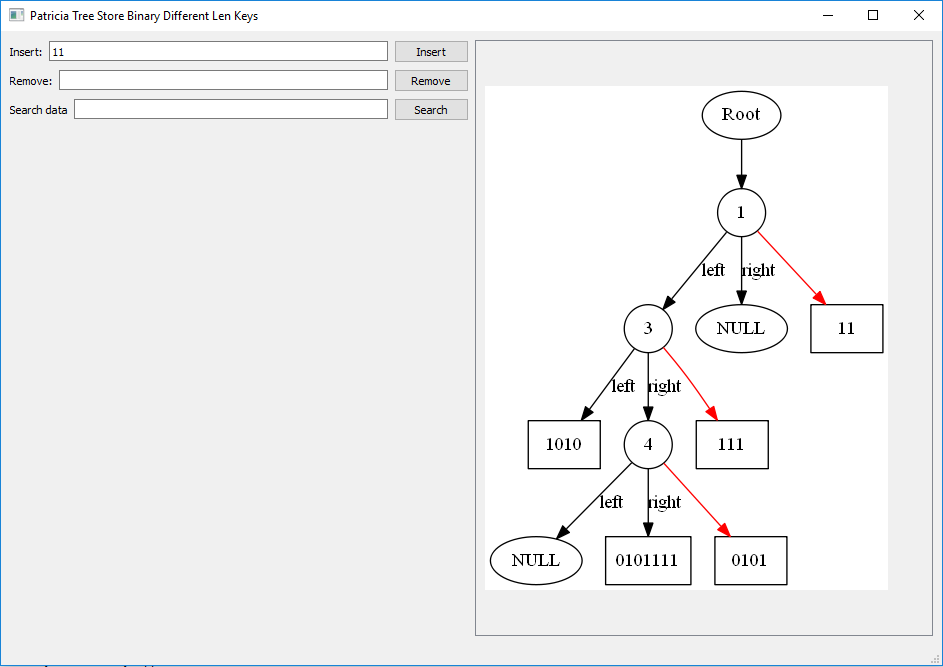
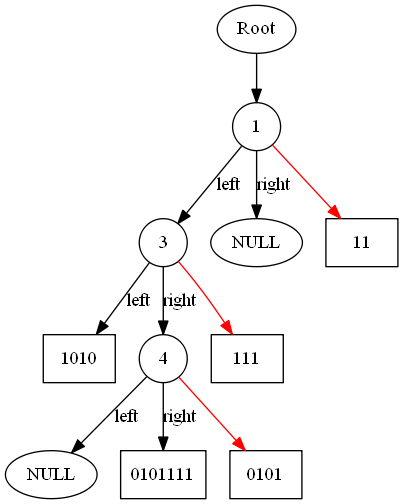
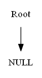
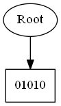
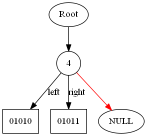
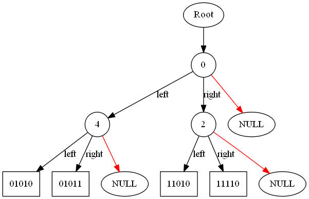
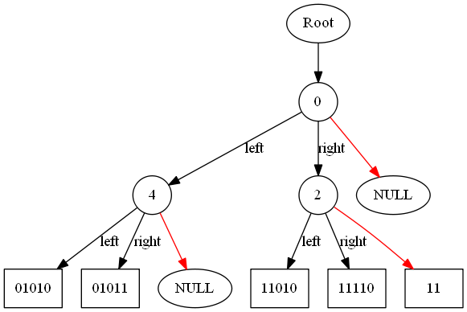
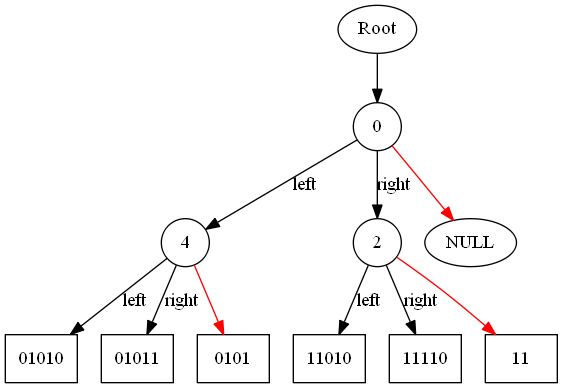
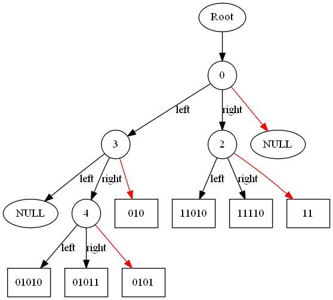
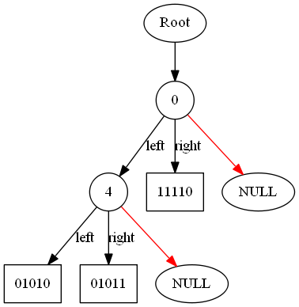

PatriciaTreeStoreBinaryDifferentLenkeys
====================
Building with AppVeyor: 

Building with Travis: 

This repository has a project with the implementation of a PatriciaTreeStoreBinaryDifferentLenkeys.

It is written in C++.

The code of the PatriciaTreeStoreBinaryDifferentLenkeys is independent of platform.

Is has two possible main files:

* [Codes](#markdown-header)
	* [A main that triggers unit test;](#markdown-header-emphasis)

	* [A Qt project to manage the queue (With Gui).](#markdown-header-strikethrough)
	
The library used to make the Unit Test is the Catch v2.12.3. The code is already in this repository.

The Qt project generates images of the PatriciaTreeStoreBinaryDifferentLenkeys, using the lib Graphviz.
Install this lib in your computer for you to be able to create such images.

The code was written containing the Doxygen documentation.

- - -

You have several options to build the project: 
====================

* [Build tools](#markdown-header)
	* [Makefile (using the file named MakefileGeneral);](#markdown-header-emphasis)
	* [CMake.](#markdown-header-emphasis)
	* [Qt Project (With QMake).](#markdown-header-emphasis)

The project has no leaks (Fully tested with Valgrind).

All the unit tests are ok.

- - -

Qt gui project: 
====================
The qt gui application gui is shown below:

Tree sample: 
====================
A sample of the tree is shown below:

- - -

The functionalities available are: 
====================

* [Functionalities](#markdown-header)
	* [Insert;](#markdown-header-emphasis)
	* [Search;](#markdown-header-emphasis)	
	* [Remove;](#markdown-header-emphasis)
	
- - -

Insertion demo steps: 
====================

## Initial

## Inserting 01010

## Inserting 01011

## Inserting 11010

## Inserting 11110

## Inserting 11

## Inserting 0101

## Inserting 010

- - -

Remove demo steps: 
====================

## Initial 

## Removing 11010

## Removing 11110

## Removing 01011

## Removing 01010

